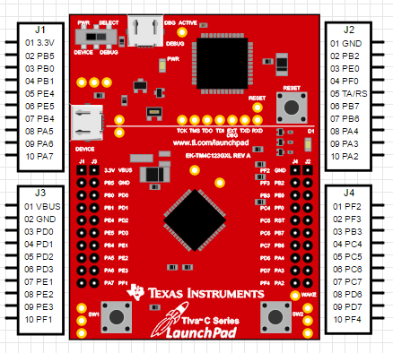
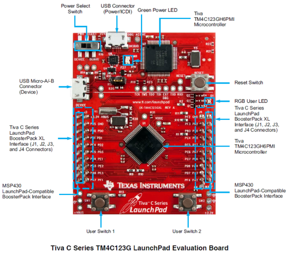
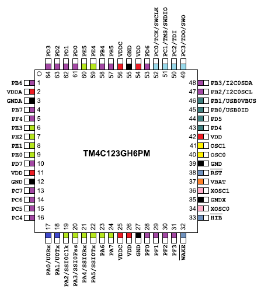
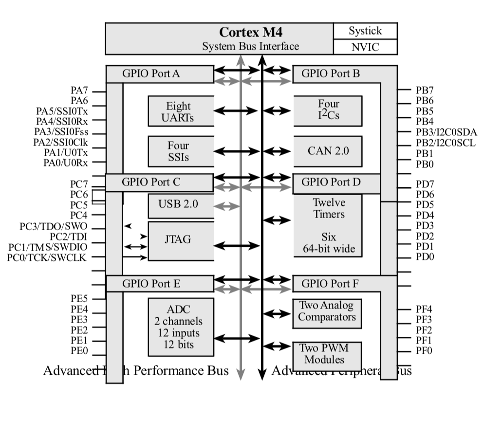
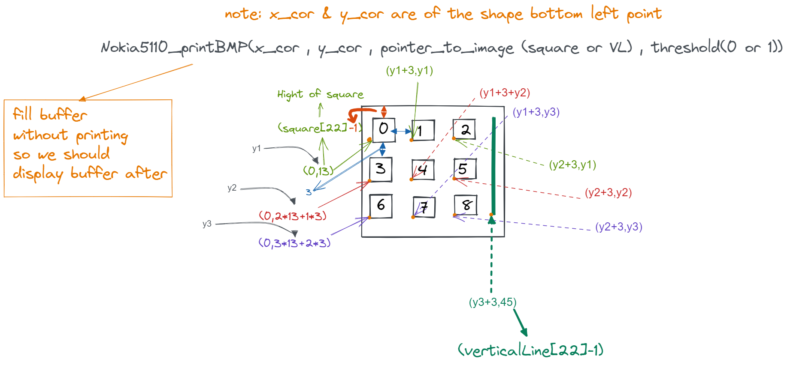

# Reaction-Time-Game-Project
Embedded project (Reaction Time Game) By using the microcontroller TM4C123GH6PM:
This project aims to design a game using the TM4C123GH6PM microcontroller where players respond to randomly lit LEDs by pressing corresponding switches, with the score of the right pressed switches displayed on an LCD. An ADC slider is used to specify the difficulty of the game. A light sensor is used to turn the game on and off, and UART is used to transmit game statistics to a PC.

The TM4C123G is a member of the class of high performance 32 bit ARM cortex M4 microcontroller with a broad set of peripherals developed by Texas Instrumentals. The TIVA launchpad has a built-in processor clock frequency of up to 80MHz with a floating-point unit (FPU). The Cortex-M4F processor also supports the tail chaining functionality. It also includes a nested vector interrupt controller (NVIC). The debugging interface used is JTAG and SWD (serial wire debugger) for programming and debugging purposes.




Without GPIOs we won’t have any other way to use a microcontroller and it will be nothing more different than a chunk of well-fabricated silicon. Through them we can interface both transducers or sensors and actuators. We can also connect other devices like a display, external devices and so on.The GPIOs of TM4C123 Tiva C ARM microcontrollers are very elaborate, having many options that are usually unavailable in common 8-bit microcontrollers and below we are providing a diagram for more ease in understanding it.

 


## Software Specifications

The project code consists of drivers files for GPIO, LCD, UART, Timers, Interrupts, and handlers for the game functionality.
The following is an example of GPIO driver with an initialized interrupt and the handler function:

```c
void PortB_Init(void)
{
  SYSCTL_RCGC2_R |= (1 << 1);   	// 1) B clock
  delay = SYSCTL_RCGC2_R;         // delay
  GPIO_PORTB_LOCK_R = 0x4C4F434B; // 2) unlock PortB PB0
  GPIO_PORTB_CR_R = 0x7F;         // allow changes to PB6-0
  GPIO_PORTB_AMSEL_R = 0;      		// 3) disable analog function
  GPIO_PORTB_PCTL_R = 0; 					// 4) GPIO clear bit PCTL
  GPIO_PORTB_DIR_R = 0x78;        // 5) PB2,PB1,PB0 input, PB3,PB4,PB5,PB6 output
  GPIO_PORTB_AFSEL_R = 0;      		// 6) no alternate function
  GPIO_PORTB_PUR_R = (1 << 0) | (1 << 1) | (1 << 2);        // enable pullup resistors on PB2-PB0
  GPIO_PORTB_DEN_R = 0x7F;        // 7) enable digital pins PB6-PB0
  GPIO_PORTB_IS_R &= ~(1 << 0) | ~(1 << 1) | ~(1 << 2);       // 8) PB2-PB0 are edge-sensitive
  GPIO_PORTB_IBE_R &= ~(1 << 0) | ~(1 << 1) | ~(1 << 2);      // PB2-PB0 are not both edges
  GPIO_PORTB_IEV_R &= ~(1 << 0) | ~(1 << 1) | ~(1 << 2);      // PB2, PB0 are falling edge event
  GPIO_PORTB_ICR_R = 0x7;         // (e) Clear flag2-flag0
  GPIO_PORTB_IM_R |= 0x7;         // (f) Arm interrupt on PB2-PB0
  NVIC_PRI0_R = (NVIC_PRI0_R & ~0x000000E0) | (2 << 5); // Set priority 2
  NVIC_EN0_R = (1 << 1);
  EnableInterrupts();
}

```

## Required Hardware I/O connections

In case of using hardware here is a list of needed components:

- Tiva C LaunchPad
- Nokia5110 Screen (Blue)
- 3 switches
- 3 RGB Leds
- Male-Female Jumbers (connectors)
- 470 ohm, 10k Resistors
- Breadboard

##### Blue Nokia 5110 Connections

| Signal       | (Nokia 5110) LaunchPad pin                                   |
| ------------ | ------------------------------------------------------------ |
| Reset        | (RST, pin 1) connected to PA7                                |
| SSI0Fss      | (CE,  pin 2) connected to PA3                                |
| Data/Command | (DC,  pin 3) connected to PA6                                |
| SSI0Tx       | (Din, pin 4) connected to PA5                                |
| SSI0Clk      | (Clk, pin 5) connected to PA2                                |
| 3.3V         | (Vcc, pin 6) power                                           |
| back light   | (BL,  pin 7) not connected, consists of 4 white LEDs which draw ~80mA total |
| Ground       | (Gnd, pin 8) ground                                          |

##### Screen Dimensioning



In The above illustration we are presenting how are graphics and arts displayed on Nokia 5110 Screen.

As you can notice the screen is 84x48 pixels in dimension and every pixel can be turned on or off according to the programmed output to the screen. So we created a matrix of square-shaped arts, each of (**14px height * 14px width**) to display the XO matrix.

# This Project was under supervision of:

- Dr: Lamiaa El-refaey
- Eng. Mahmoud Nawar
